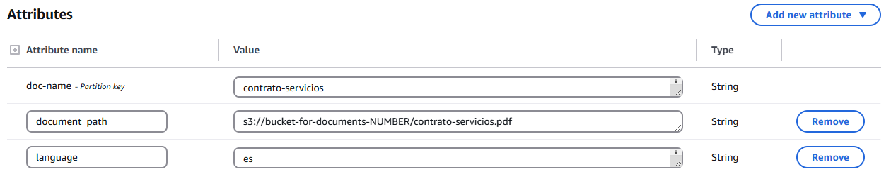
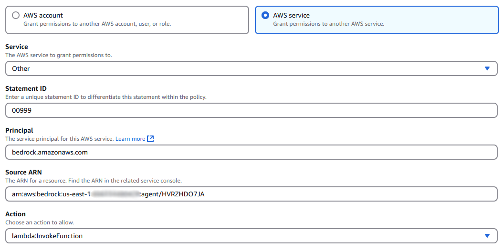
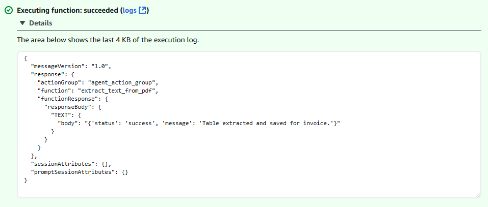
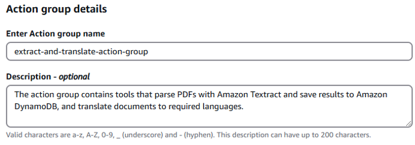
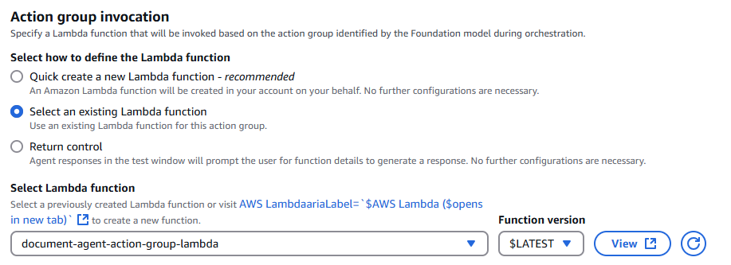
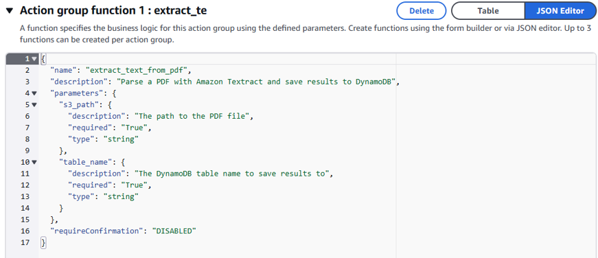
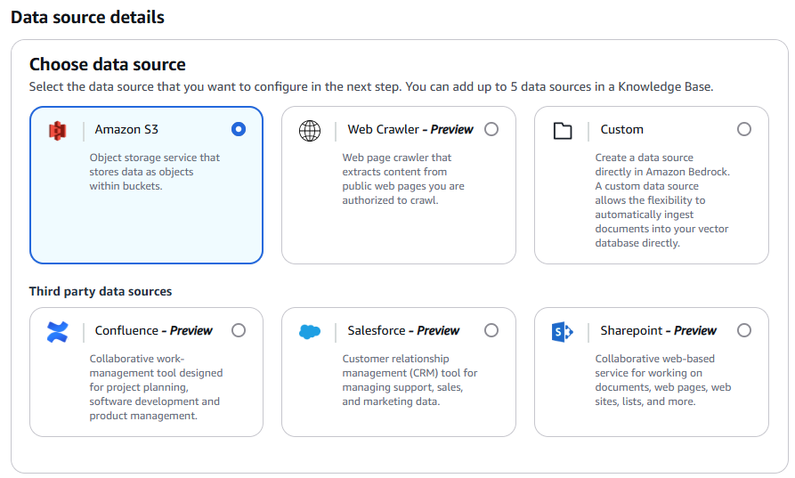
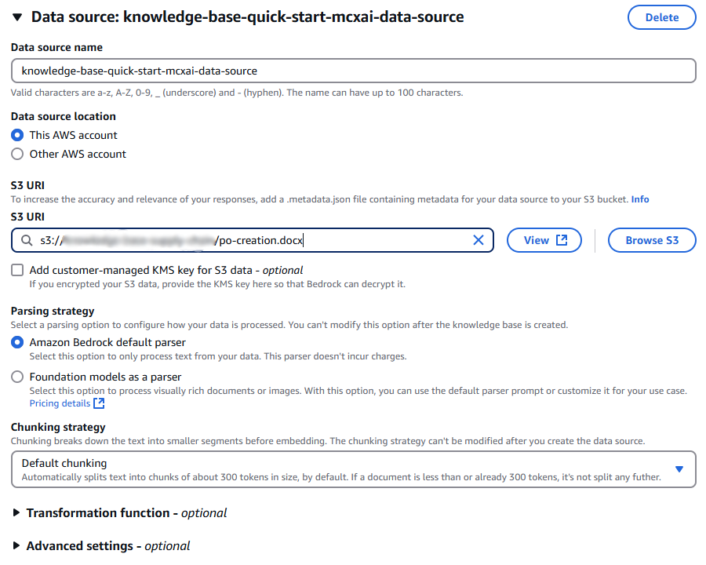
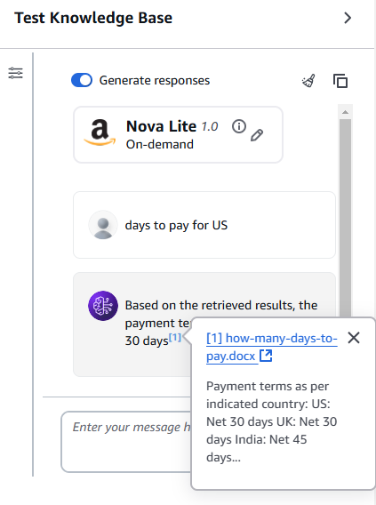

# Building an Amazon Bedrock Agent for Document Processing 

Welcome to building document assistant using Amazon Bedrock Agents.


## What Document Processing Agent Can Do

### Basic tasks:

1. Summarize: given a document, return its summary
2. Retrieve info: question-answer based on a document
3. Analyze data: simple quantitative data analysis
4. Generate plot: based on the document data
5. Make changes: adjust content formats


### Advanced tasks:

1. AWS services: integrate with various services, ex. Textract, Translate, etc.
2. Complex pipelines: accomplish multi-step changes and tasks
3. Knowledge bases: RAG-based search across documents


## What is Bedrock Agent?

Agents for Amazon Bedrock helps you accelerate generative artificial intelligence (AI) application development by orchestrating multistep tasks.
They can make different API calls. 
Agents extend FMs to understand user requests, break down complex tasks into multiple steps, carry on a conversation to collect additional information, and take actions to fulfill the request.

- [How Agents for Amazon Bedrock works](https://docs.aws.amazon.com/bedrock/latest/userguide/agents-how.html)

## Let's build!

### :one: Step 1: Create Bedrock agent

**Prerequisites**: we will use `Amazon Nova Lite v1` as model, make sure that you [have access to it in your account](https://docs.aws.amazon.com/bedrock/latest/userguide/model-access.html).

1. Go to [Bedrock console](https://us-east-1.console.aws.amazon.com/bedrock/home?region=us-east-1#/overview), select `Agents` in the left navigation panel, then click on the `Create Agent` button
2. Provide `agent-for-document-processing` as Agent name, provide a description (optional). Click on the `Create` button.


3. You can now open the `Agent builder`, the place where you can access and edit the overall configuration of an agent. 
We will select `Amazon Nova Lite v1` as model ([Pricing](https://aws.amazon.com/bedrock/pricing/)); Paste the following text as Instructions for the Agent:
```markdown
You are a document processing agent skilled at extracting key information from documents, translating content, summarizing text, and manipulating data formats. 
Your tasks include finding key points in documents, locating documents in Amazon S3 and querying them, altering date formats in Excel files, summarizing long documents, 
parsing PDFs with Amazon Textract and saving results to Amazon DynamoDB, and translating documents to required languages. 
Use your capabilities to assist users with efficiently processing and analyzing document data.
```
4. In Additional settings, select `Enabled` for Code Interpreter


Leave all the rest as default. Then, choose `Save and Exit` to update the configuration of the agent.
In the test chat, click `Prepare` to update the agent.

#### Now, you can test the agent! 🎉
 
👉 Append `sample-company-report.docx` (can be found inside `example-documents`) and ask:
```markdown
what are the next crucial action items?
```
👉 Append `sales_data.xlsx` (can be found inside `example-documents`) TO THE CODE EDITOR and ask:
```markdown
alter sales dates to american format: instead of using YYYY-MM-DD, use YYYY-DD-MM, output updated file
```

### :two: Step 2: Add action group

#### Prepare testing files in S3 bucket

1. Go to [S3 console](https://s3.console.aws.amazon.com/s3/get-started?region=us-east-1&bucketType=general) and click on the `Create bucket` button
2. Give your bucket a unique name, for example `bucket-for-documents-NUMBER`. Click `Create bucket`.
3. Select your created bucket, click on the `Upload` button.
4. You can drag and drop `invoice.pdf` and `contrato-servicios.pdf` files (can be found inside `example-documents`) and then click on the `Upload` button

#### Prepare data in DynamoDB table

1. Navigate to the [DynamoDB console](https://us-east-1.console.aws.amazon.com/dynamodbv2/home?region=us-east-1#service) and click on `Create table`.
2. Enter `invoices-parsed` as `Table name` and `doc-name` as `Partition key`. Click on the `Create table` button.
3. Once the table is created, we don't need to add values. Agent will add values there.

Let's create one more table:

1. Go to `Tables` and click on `Create table`.
2. Enter `foreign-docs` as `Table name` and `doc-name` as `Partition key`. Click on the `Create table` button.
3. Click on the created table, then click on the `Actions` button and select `Create item` from the drop-down list. 
4. Paste `contrato-servicios` as `doc-name`
5. Click on the `Add new attribute` button and select `String`. Paste `document_path` as Attribute name and `s3://bucket-for-documents-NUMBER/contrato-servicios.pdf` as value.
6. Click on the `Add new attribute` button and select `String`. Paste `language` as Attribute name and `es` as value.
7. Finally, click on the `Create item` button.



#### Prepare Lambda function

Lambda Function will manage the logic required for complex actions.
Code contains set of APIs that Bedrock agent will call. The function will then format the response and send it back to the agent.

1. Navigate to the [Lambda Console](https://us-east-1.console.aws.amazon.com/lambda/home?region=us-east-1#/functions) and click on `Create function` button.
2. Paste `document-agent-action-group-lambda` as a function name and choose `Python 3.11` as a runtime
3. Click on `Create function` button in the bottom of the page

**Update permissions:**

1. Once the function is created, click on the Configuration Tab in the same page and Choose `Permissions` from the left side panel
2. Click on `Add permissions` button in Resource-based policy statement section to provide the permission to invoke lambda functions from Bedrock
3. Select `AWS service`, `Other` as Service, provide any valid Statement Id. Provide `bedrock.amazonaws.com` as Principal, your agent ARN as Source ARN, and Action as `lambda:InvokeFunction`. Click `Save`.



4. Under the Execution role, click on the role link. Under Permission policies, click on `Add permissions` button, select `Attach policies`. 
5. Search for `TranslateReadOnly`, then click on `Add permissions`. Now Lambda can call Translate.
6. Under Permission policies, click on `Add permissions` button, select `Create inline policy`. 
7. Click on `JSON`, then paste JSON from the `lambda-policy/DocumentLambdaServicePolicy.json`.
8. Click `Next`, name the policy `DocumentLambdaServicePolicy` and click on `Create policy`. Now your Lambda has required access to Textract, S3, DynamoDB.

**Adjust the timeout:**

1. Choose `General configuration` from the left side panel 
2. Click on the `Edit` button
3. Modify `Timeout` by increasing it to 1 minute 30 seconds to make sure your Lambda won't fail while waiting for document parsing.
4. Click on the `Save` button

**Add code:**

1. Now you can go back to the Lambda function, click on the `Code` tab in the same page 
2. Copy the code from `lambda_function.py` and replace the code in code editor.
3. Click on the `Deploy` button.

**Test your Lambda:**

Since our Lambda contains a set of APIs, you may want to create several test events to test each API.

1. Click on the `Test` tab near the top of the page.
2. Fill in `Event name`: `extract-text` 
3. Paste the code from `lambda-payloads/extract-text.json` in `Event JSON` window. DON'T FORGET TO CHANGE S3 BUCKET NAME! 
This will be a test event for the `extract_text_from_pdf` API that matches how the Agent will send a request.
4. Click on `Save` and then `Test` to execute the Lambda function. You should see the results of the successful function invocation.



5. Click on `Create new event` button and repeat steps 2-4 to add one more test event (you can find JSON payload in the `lambda-payloads/translate-test.json`) 


#### CREATE ACTION GROUP

An **action group** is a toolbox that defines actions the agent can help the user perform.

One agent can have up to 20 action groups - see [Bedrock quotas](https://us-east-1.console.aws.amazon.com/servicequotas/home/services/bedrock/quotas).

To create Action group: in the `Agent builder` choose `Add` in the Action groups section. 

Use `extract-and-translate-action-group` as Action group name.

Use the following description:
```markdown
The action group contains tools that parse PDFs with Amazon Textract and save results to Amazon DynamoDB, and translate documents to required languages.
```


In the Action group type section, select `Define with function details`. 

In the Action group invocation section, select `Select an existing Lambda function` and select `document-agent-action-group-lambda` as Lambda function. 


**We will add 2 action group functions.**

Click on the `Add action group function`, then select `JSON Editor` and paste the following:

```json
{
  "name": "extract_text_from_pdf",
  "description": "Parse a PDF with Amazon Textract and save results to DynamoDB",
  "parameters": {
    "s3_path": {
      "description": "The path to the PDF file",
      "required": "True",
      "type": "string"
    },
    "table_name": {
      "description": "The DynamoDB table name to save results to",
      "required": "True",
      "type": "string"
    }
  },
  "requireConfirmation": "DISABLED"
}
```



Next, click on the `Add action group function`, then select `JSON Editor` and paste the following:

```json
{
  "name": "translate_document",
  "description": "Retrieve a PDF document by its name, check its language, translate if needed, save and update DynamoDB.",
  "parameters": {
    "document_name": {
      "description": "PDF document name",
      "required": "True",
      "type": "string"
    },
    "table_name": {
      "description": "The DynamoDB table name to save results to",
      "required": "True",
      "type": "string"
    }
  },
  "requireConfirmation": "DISABLED"
}
```

Click on `Save and exit` to exit from Action group editing. 

Next, click on `Save and exit` to exit from the Agent builder.

In the test chat, click `Prepare` to update the agent.

#### Now, you can test the agent! 🎉
 
👉 Go to the chat with agent and ask:
```markdown
translate the contrato-servicios document, you can find it in foreign-docs table
```
👉 Go to the chat with agent and ask (DON'T FORGET TO CHANGE THE BUCKET NAME!):
```markdown
extract text from file s3://bucket-for-documents-NUMBER/invoice.pdf and update the invoices-parsed table
```

### :three: Step 3: Add knowledge base

#### Prepare Knowledge base files in S3 bucket

1. Go to [S3 console](https://s3.console.aws.amazon.com/s3/get-started?region=us-east-1&bucketType=general) and click on the `Create bucket` button
2. Give your bucket a unique name, for example `knowledge-base-NUMBER`. Click `Create bucket`.
3. Select your created bucket, click on the `Upload` button.
4. You can drag and drop `how-many-days-to-pay.docx` and `po-creation.docx` files (can be found inside `knowledge-base-docs`) and then click on the `Upload` button

#### Create Knowledge base

1. Go to [Bedrock console](https://us-east-1.console.aws.amazon.com/bedrock/home?region=us-east-1#/overview), choose **Builder tools -> Knowledge Bases** from the navigation pane.
2. Click on `Create` and select `Knowledge base with vector store`
3. Specify `knowledge-base-internal-docs` as name, select `Amazon S3` as data source, click `Next`.



4. Add 2 data sources: these should be .docx files that you uploaded to the `knowledge-base-NUMBER` S3 bucket. Specify **S3 URI locations** for each of them, leave the rest as default. Click `Next`



5. Specify any embedding model (make sure you have [enabled access](https://docs.aws.amazon.com/bedrock/latest/userguide/model-access.html) to it). Select `Quick create a new vector store` and `Amazon OpenSearch Serverless`, click `Next`.
6. After you review and create your knowledge base, make sure to **Sync data sources** and **select a model** to test.
7. In the chat, write: `days to pay for US` to make sure your Knowledge base works.



#### Add Knowledge base to the agent

1. Go back to your agent, open `Agent builder`. Under the `Knowledge bases`, click `Add`
2. Select `knowledge-base-internal-docs` and provide for Instructions:
```markdown
Search in knowledge base information that is specific to a company or certain country
```
3. Click `Add`. You can add up to 2 Knowledge bases per agent.
4. In the test chat, click `Prepare` to update the agent.

#### Now, you can test the agent! 🎉
 
👉 Go to the chat with agent and ask:
```markdown
purchase order number generation
```

## Possible errors

#### 1. Incorrectly formatted overridden prompt: 


To resolve: **Enable Code Editor**

#### 2. Access denied while invoking Lambda function:


To resolve: **[add a resource-based policy statement on the Lambda](https://repost.aws/questions/QUXk7QWdzGTh-c5MIWch9NNQ/error-when-bedrock-agent-invoke-lambda)**

#### 3. Error processing the Lambda response: 


To resolve: **[Check Lambda output format](https://docs.aws.amazon.com/bedrock/latest/userguide/agents-lambda.html#agents-lambda-response)**